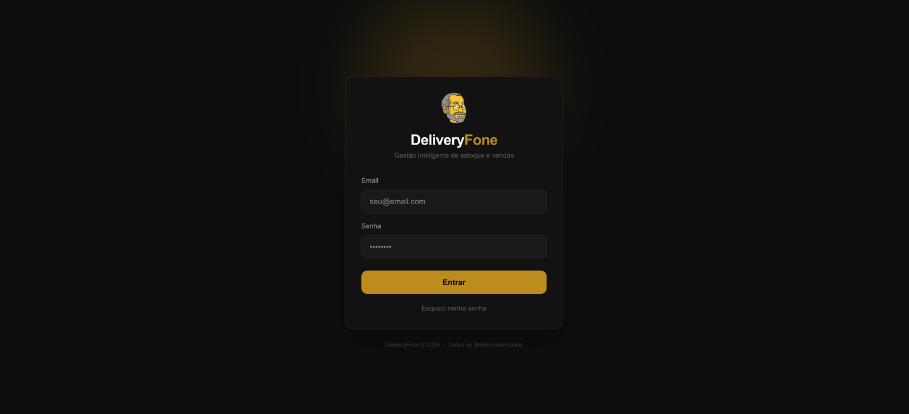
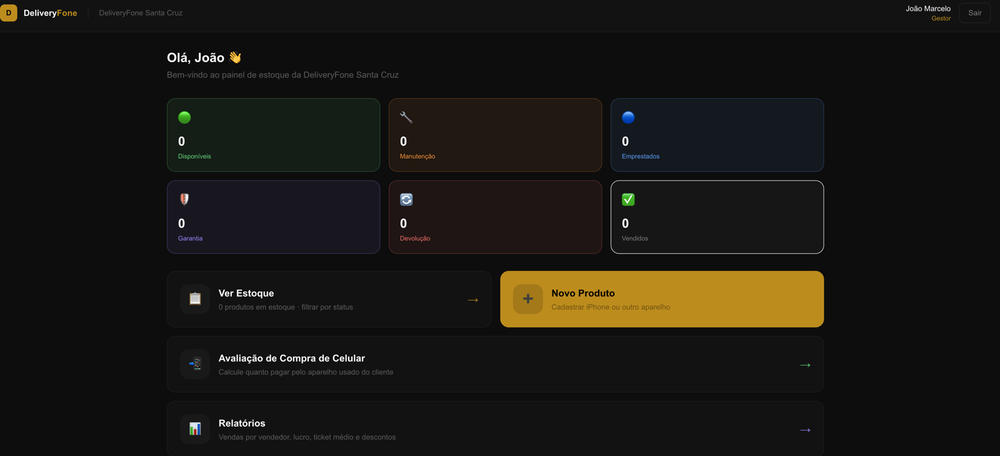
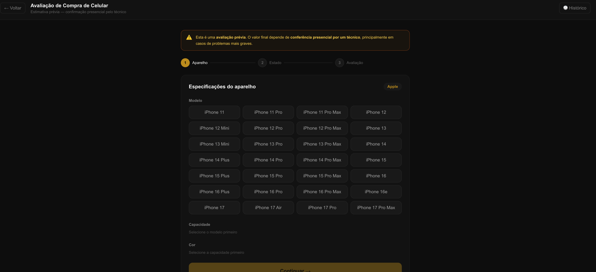
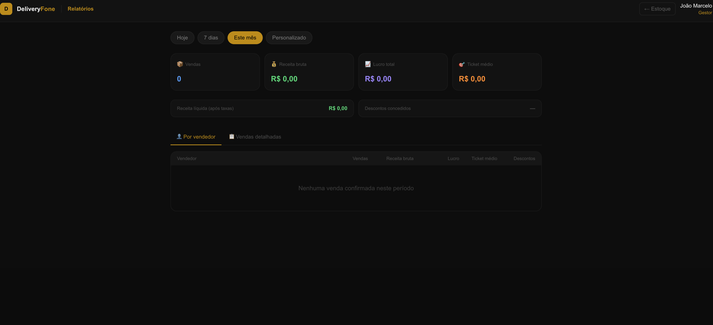
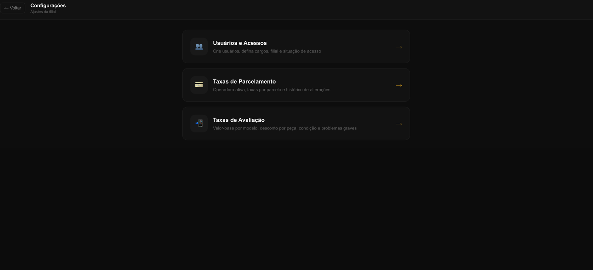

# DeliveryFone Trade OS

> Gestão inteligente de estoque e vendas para operações de varejo de telefonia.

O **DeliveryFone Trade OS** é uma aplicação web criada a partir de necessidades reais da rotina de uma loja de celulares. O sistema centraliza estoque, formação de preços, simulações, vendas, avaliação de aparelhos usados, relatórios e configurações operacionais em um único ambiente, com acessos distintos para gestores e vendedores.

O projeto nasceu como evolução de controles construídos inicialmente no Google Sheets e hoje funciona como uma base operacional integrada, com autenticação, regras por filial e persistência de dados no Supabase.

> **Repositório de portfólio:** esta versão pública apresenta a evolução técnica do projeto. Credenciais, dados reais da operação e configurações do ambiente de produção não fazem parte deste repositório.

## Visão geral



### Painel operacional

O painel apresenta a situação do estoque por status e concentra os principais atalhos da operação.



### Avaliação de aparelhos usados

Fluxo guiado para estimar o valor de compra de um aparelho, considerando modelo, capacidade, cor, estado, peças e critérios configurados pela gestão. A avaliação é uma estimativa e prevê confirmação presencial por um técnico.



### Relatórios

Indicadores por período com vendas, receita, lucro, ticket médio, descontos e desempenho por vendedor.



### Configurações administrativas

Área reservada à gestão para administrar usuários e acessos, taxas de parcelamento e parâmetros de avaliação.



## Destaques técnicos

- aplicação full stack com Next.js e TypeScript;
- autenticação e persistência integradas ao Supabase;
- autorização em múltiplas camadas: interface, middleware, servidor e banco;
- separação de dados e permissões por filial;
- rotas administrativas protegidas para gestão de usuários;
- atualizações em tempo real para refletir mudanças operacionais;
- testes automatizados sobre regras críticas do negócio;
- versionamento com Git/GitHub e implantação contínua na Vercel;
- variáveis de ambiente e credenciais mantidas fora do código público.

## O problema que deu origem ao projeto

Na rotina da loja, informações importantes ficavam distribuídas entre ERP, planilhas e consultas aos gestores. Custos, fornecedores, preços, taxas de cartão, limites de desconto e avaliações de aparelhos usados nem sempre estavam disponíveis de forma rápida para a equipe comercial.

A primeira solução foi uma estrutura no Google Sheets, com estoque e cálculos automatizados. Ela resolveu parte do problema, mas ainda exigia muitos controles paralelos e decisões centralizadas na gestão.

O DeliveryFone Trade OS nasceu para transformar esses processos em uma aplicação única: o gestor configura as regras da operação e acompanha os resultados, enquanto o vendedor encontra as informações necessárias para atender e negociar com mais autonomia.

## Funcionalidades

- autenticação e recuperação de senha;
- usuários associados a uma filial, com cargos de gestor e vendedor;
- criação, edição, ativação e desativação de usuários dentro do aplicativo;
- estoque com pesquisa, filtros e estados operacionais;
- cadastro de aparelhos novos e seminovos;
- registro de IMEI, capacidade, cor, condição, bateria, custo, fornecedor e origem;
- preços, promoções e acompanhamento do tempo em estoque;
- cálculo de parcelamento com taxas configuráveis por operadora;
- simulação de vendas com entrada, parcelamento e aparelho usado na troca;
- reserva, registro e confirmação de vendas;
- avaliação prévia de aparelhos usados com critérios configuráveis;
- histórico de avaliações;
- solicitações de desconto com aprovação, recusa ou contraproposta;
- relatórios de vendas, receita, lucro, ticket médio e descontos;
- desempenho por vendedor e exportação de dados em CSV.

## Perfis e permissões

### Gestor

O gestor administra a operação da própria filial. Entre suas responsabilidades estão:

- gerenciar usuários, cargos e situação de acesso;
- cadastrar e editar produtos;
- consultar custos, fornecedores, margens e histórico;
- configurar taxas de parcelamento e critérios de avaliação;
- acompanhar vendas, descontos e indicadores;
- confirmar operações registradas pelos vendedores.

### Vendedor

O vendedor trabalha com as informações necessárias ao atendimento, sem acesso às configurações e aos dados financeiros restritos à gestão. Ele pode:

- consultar aparelhos e condições comerciais;
- simular pagamentos;
- incluir aparelho usado em uma negociação;
- reservar produtos e registrar vendas;
- solicitar condições de desconto;
- consultar suas vendas e seus indicadores.

## Regras de negócio importantes

- o cálculo parcelado considera a taxa da operadora para preservar o valor líquido esperado pela loja;
- custos, margens e configurações ficam restritos ao gestor;
- uma venda registrada pelo vendedor aguarda conferência antes de ser confirmada;
- reservas e vendas validam o estado atual do aparelho para reduzir conflitos;
- descontos fora da autonomia do vendedor passam por aprovação da gestão;
- a avaliação de usados é uma estimativa inicial sujeita à conferência presencial;
- usuários e dados operacionais são isolados por filial;
- aparelhos vendidos permanecem registrados para histórico e relatórios.

## Segurança e integridade

A aplicação combina diferentes camadas de proteção:

- autenticação pelo Supabase Auth;
- autorização por cargo no servidor e nas rotas protegidas;
- isolamento dos usuários pela filial associada ao perfil;
- Row Level Security (RLS) no PostgreSQL;
- chave administrativa utilizada exclusivamente no servidor;
- senhas nunca armazenadas em tabelas de perfil ou auditoria;
- desativação de contas aplicada no Auth e no acesso ao sistema;
- registro de ações administrativas relevantes;
- arquivos de ambiente e credenciais fora do versionamento.

## Tecnologias

- **Next.js 16** e **React 19**;
- **TypeScript**;
- **Tailwind CSS 4**;
- **Supabase**: Auth, PostgreSQL, Row Level Security e Realtime;
- **Jest** e **ts-jest**;
- **ESLint**;
- **Vercel** para implantação contínua.

## Arquitetura resumida

```text
Navegador
   │
   ▼
Next.js (interface, middleware e rotas do servidor)
   │
   ├── Supabase Auth (sessões e contas)
   ├── PostgreSQL + RLS (dados e permissões)
   └── Realtime (atualizações da operação)
```

As operações administrativas são validadas novamente no servidor. A interface não é considerada uma barreira de segurança: cargo, situação e filial do usuário são conferidos antes de qualquer ação privilegiada.

## Executando localmente

O código pode ser analisado e executado localmente, mas as funcionalidades dependem de um projeto Supabase compatível. O ambiente operacional utilizado nos testes da loja é privado e não acompanha esta versão de portfólio.

### Pré-requisitos

- Node.js;
- npm;
- projeto Supabase com a estrutura usada pela aplicação.

### Instalação

1. Clone o repositório e acesse a pasta:

   ```bash
   git clone <URL_DO_REPOSITORIO>
   cd deliveryfone-trade-os
   ```

2. Instale as dependências:

   ```bash
   npm install
   ```

3. Crie `.env.local` na raiz:

   ```env
   NEXT_PUBLIC_SUPABASE_URL=sua_url_do_supabase
   NEXT_PUBLIC_SUPABASE_ANON_KEY=sua_chave_anonima_do_supabase
   SUPABASE_SERVICE_ROLE_KEY=sua_chave_administrativa
   ```

   `SUPABASE_SERVICE_ROLE_KEY` deve existir somente no servidor. Nunca use o prefixo `NEXT_PUBLIC_`, exponha a chave no navegador ou inclua o arquivo de ambiente em commits.

4. Aplique os scripts SQL de `supabase/`, incluindo a migração de gestão de usuários:

   ```text
   supabase/migrations/20260824_user_management.sql
   ```

5. Inicie o projeto:

   ```bash
   npm run dev
   ```

6. Acesse `http://localhost:3000/login`.

## Comandos

```bash
npm run dev       # ambiente de desenvolvimento
npm run build     # build de produção
npm run start     # executa o build
npm run lint      # análise estática
npm test          # testes unitários
npm run test:watch
```

## Qualidade

O projeto possui testes automatizados para cálculos financeiros, taxas, avaliação de aparelhos, funções auxiliares e regras de gerenciamento de usuários. Antes de cada publicação, o fluxo recomendado é executar testes, análise estática e build de produção.

## Estado atual

O sistema está em desenvolvimento e já possui um ambiente privado de teste para validação no dia a dia da operação. Os fluxos existentes continuam sendo revisados conforme o uso real aponta ajustes de experiência, regras e segurança.

## Próximos passos

- ampliar a cobertura de testes e os cenários de integração;
- implementar rotina de backup externo e políticas de recuperação;
- evoluir o histórico de alterações e a rastreabilidade das operações;
- aprimorar a experiência em dispositivos móveis;
- adicionar catálogo de mídia por aparelho;
- desenvolver tarefas internas para gestores e vendedores;
- ampliar indicadores comerciais e operacionais.

## Desenvolvimento e aprendizado

A definição do problema, dos fluxos e das regras de negócio partiu da experiência direta do autor com a gestão de uma loja de celulares. Ferramentas de inteligência artificial foram utilizadas como apoio na implementação, revisão e investigação de problemas.

O projeto também funciona como uma base prática de aprendizado em desenvolvimento web, banco de dados, segurança, testes, Git/GitHub e implantação contínua. O objetivo é evoluir a solução ao mesmo tempo em que aumenta a compreensão e a autonomia técnica sobre cada parte do sistema.

---

**DeliveryFone Trade OS** — Gestão inteligente de estoque e vendas.
